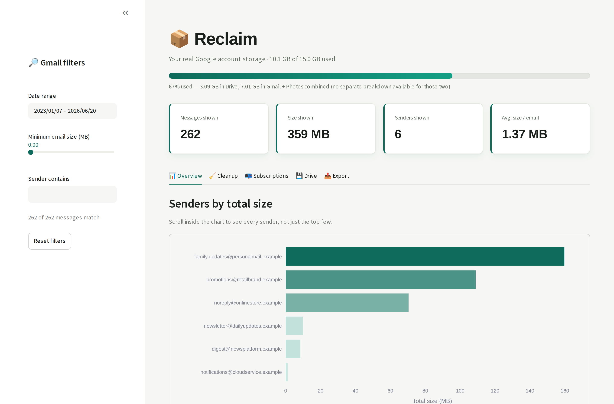
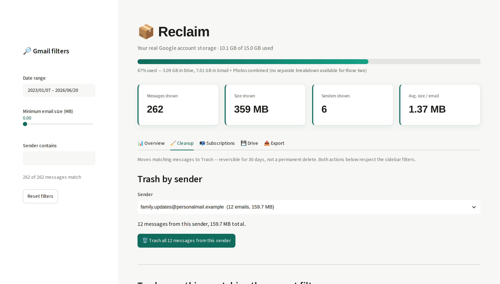
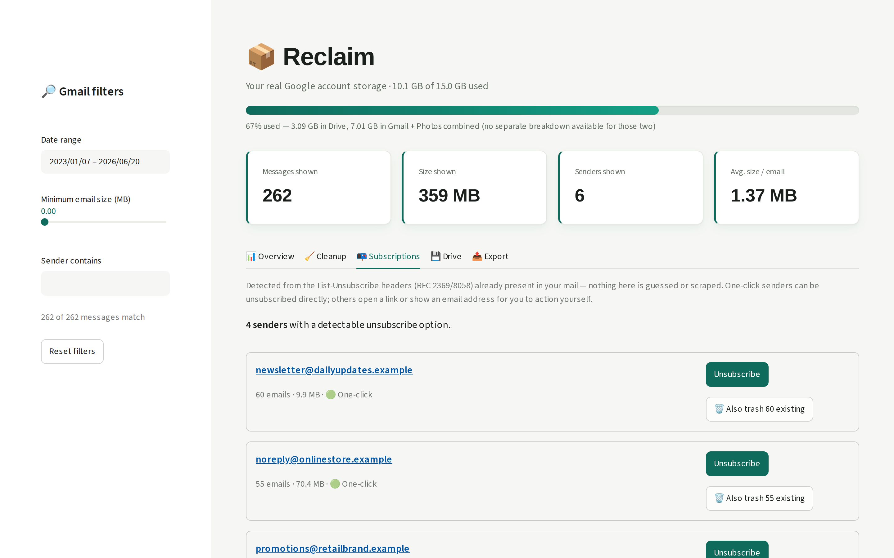
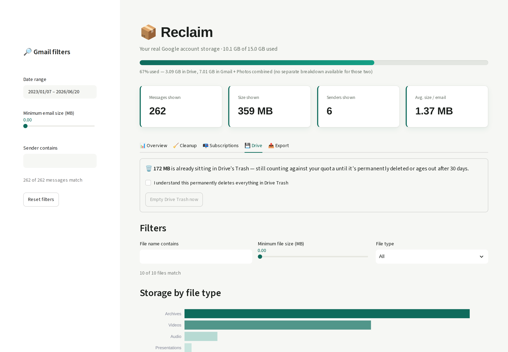
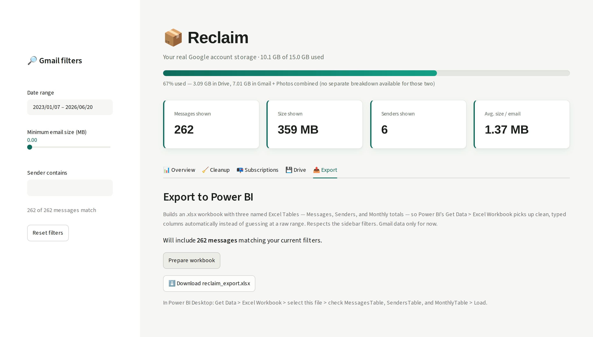

# Reclaim

A tool for seeing what's actually eating your Google account storage
-- Gmail and Drive both -- and clearing it out safely. Runs entirely
on your own machine, under your own Google account: no shared server,
no one else's data ever touches yours or vice versa.



*(Screenshot uses generated placeholder data on fake `.example`
addresses -- see [Screenshots](#screenshots) below.)*

**Cloning this?** Every user creates their own free Google Cloud
project and OAuth client in the setup below -- nothing here is shared
between users, and nothing to request access to. Because that project
stays in "Testing" mode (see why below), you'll see Google's
"unverified app" screen the first time you log in. That's expected --
click **Advanced > Go to (your app name) (unsafe)** to continue. It
shows up because the OAuth client itself isn't Google-verified, not
because anything is actually wrong; verifying it would mean an annual
paid security audit for a tool that's just you (or you and a few
friends) checking your own account, which isn't worth it here.

## What it does

- **Gmail**: which senders and individual emails are using the most
  space, bulk cleanup by sender or filter, and newsletter
  unsubscribing via the same headers Gmail's own Unsubscribe button
  reads.
- **Drive**: which files are using the most space, broken down by
  type, with the same trash-based cleanup philosophy -- plus a
  one-click "empty Drive Trash" for space that's already just sitting
  there waiting to be purged.
- **A real quota bar**: once Drive is connected, the header shows your
  actual Google account usage (the literal "X% of 15GB used" figure)
  instead of a number scoped only to what's been scanned.

Not covered: **Google Photos**. Google locked down third-party access
to existing photo libraries in March 2025 -- apps can now only see
photos *they themselves* uploaded, not your existing library. There's
no API path around this; the only option is a manual bulk export via
Google Takeout, which isn't something a live dashboard can integrate.

## 1. Set up a Google Cloud project (~5 minutes)

**Prefer a guided walkthrough?** Run `python setup_wizard.py` instead
of following the steps below by hand -- it opens the right console
page at each step, tells you exactly what to click, and writes your
credentials straight to `.env` for you. Needs nothing beyond Python
itself, so it's safe to run before installing anything else. The
steps below are what it walks you through, if you'd rather do it
manually or just want to know what it's doing.

1. Go to [console.cloud.google.com](https://console.cloud.google.com/)
   and create a new project (or reuse one).
2. **APIs & Services > Library** -- search for and enable both the
   **Gmail API** and the **Google Drive API**.
3. **APIs & Services > OAuth consent screen**:
   - User type: **External**
   - Fill in the required fields (app name, your email) -- nothing
     else matters since you're staying in testing mode
   - Add scopes: `.../auth/gmail.readonly`, `.../auth/gmail.modify`,
     and `.../auth/drive` -- full Drive access is wider than most of
     the app needs (listing files and trashing them individually only
     ever touch metadata), but Google's `emptyTrash` endpoint, used by
     the Empty Drive Trash button, specifically requires this scope
     with no narrower option. Nothing in this app reads or writes
     your file content regardless of what the scope permits.
   - Under **Test users**, add your own Gmail address
   - Leave the app in **Testing** status -- this is what avoids
     Google's verification process entirely. Testing mode supports up
     to 100 users and never expires as long as you don't publish it.
4. **APIs & Services > Credentials > Create Credentials > OAuth client ID**:
   - Application type: **Desktop app**
   - Click the client you just created to reveal its **Client ID** and
     **Client secret**
   - Copy `.env.example` to a new file named `.env` in this folder,
     and paste your client ID and secret in there
   - (Alternative: click **Download JSON** instead and save it as
     `credentials.json` in this folder -- either method works, `.env`
     is just less fiddly to set up)

## 2. Install and run

```bash
pip install -r requirements.txt

python gmail_fetch_data.py
# A browser window opens -- sign in and consent (covers both Gmail
# and Drive in one go). This walks your whole mailbox, so it can take
# a few minutes on a large account. Only downloads headers and size,
# never message bodies.

python drive_fetch_data.py
# Much faster than the Gmail scan -- Drive's API is far less rate
# limited. Also fetches your real account quota for the header bar.

streamlit run dashboard.py
```

Run the two fetch scripts in either order, or skip `drive_fetch_data.py`
entirely if you only want the Gmail side -- the dashboard falls back
gracefully to a Gmail-only view when there's no Drive data yet.

The dashboard opens in your browser. Use the **sidebar filters** (date
range, minimum size, sender search) to narrow down the Gmail tabs --
**Overview**, **Cleanup**, **Subscriptions**, and **Export**. **Drive**
has its own local filters, since files don't have senders or dates in
the same sense emails do.

- **Overview** shows every sender your filters match in a scrollable
  chart (not just the top 20) plus a table of your largest individual
  emails.
- **Cleanup** lets you either trash everything from one sender, or
  trash everything currently matching your filters in one bulk action
  (behind a confirmation checkbox, since that can span many senders at
  once).
- **Subscriptions** finds newsletters you can unsubscribe from, so the
  same buildup doesn't happen again.
- **Drive** shows your largest files by type, lets you trash
  individual files or everything matching a filter, and surfaces
  anything already sitting in Drive's Trash with a one-click "empty
  it now" action.
- **Export** builds a Power BI-ready `.xlsx` workbook of your filtered
  Gmail data.

### Unsubscribing from newsletters

The Subscriptions tab reads the `List-Unsubscribe` /
`List-Unsubscribe-Post` headers (RFC 2369 / RFC 8058) that Gmail and
Yahoo have required from bulk senders since 2024 -- the same headers
Gmail's own "Unsubscribe" button uses. Nothing is guessed or scraped.

Each sender shows up as one of three types, handled deliberately
differently:

- 🟢 **One-click** -- the sender supports RFC 8058, so **Unsubscribe**
  sends the standardized one-click request directly. This is exactly
  what Gmail's own button does, and Gmail only shows that button when
  the sender's DKIM signature verifiably covers the headers, which
  rules out spoofing.
- 🔵 **Manual link** -- an unsubscribe URL exists but without one-click
  support. Opens in a new tab for you to review and finish yourself.
- ✉️ **Email required** -- only a `mailto:` address was given. Opens
  your email client with the address filled in; nothing is sent
  automatically.

There's deliberately no "unsubscribe from everything" bulk button the
way Cleanup has bulk-trash. Trashing your own mail is fully
reversible; an unsubscribe click on a sender you don't actually
recognize isn't quite the same risk category, so this stays a
reviewed, per-sender action. Each row also has an **Also trash
existing** button, so you can unsubscribe and clear out what's
already in your mailbox from that sender in one place.

### Cleaning up Drive

Two things filtered out automatically, because neither takes up any of
your quota:

- **Native Google Docs/Sheets/Slides/Forms/Drawings/folders** -- these
  have no byte size of their own; Google doesn't charge for them
  regardless of how much content is "inside" them.
- **Files shared with you by someone else** -- those count against the
  *owner's* quota, not yours.

Trashing a file works the same as Gmail: reversible for 30 days, not
gone immediately. The one exception is **Empty Drive Trash**, which
appears when you already have something sitting in Drive's Trash --
since those files are already just waiting to be purged, this
permanently deletes them now instead of waiting out the 30 days, so
the space is actually freed immediately. It's the one irreversible
action in the app, and it's behind its own confirmation checkbox.

### Using the Power BI export

Click **Prepare workbook**, then **Download**. The file has three
named Excel Tables (not just raw ranges), which is what lets Power BI
auto-detect clean, typed columns:

- **MessagesTable** -- one row per email: sender, date, size (MB and
  bytes), message ID
- **SendersTable** -- totals per sender: total MB, message count,
  average MB
- **MonthlyTable** -- totals per calendar month, ready for a
  time-series chart

In Power BI Desktop: **Get Data > Excel Workbook**, select the file,
tick all three tables in the navigator, and **Load**. Because dates
and numbers are written as real Excel types (not text), Power BI picks
up the right data types automatically -- no manual type-fixing needed.
Gmail data only for now; Drive isn't part of this export yet.

## Screenshots

<table>
<tr>
<td></td>
<td></td>
</tr>
<tr>
<td></td>
<td></td>
</tr>
</table>

All screenshots (including the one at the top) were captured against
**generated placeholder data** -- fake sender addresses on `.example`
domains (a domain suffix reserved by RFC 2606 specifically for
documentation, guaranteed to never resolve to anything real) and
made-up file names, not a real account. No real email addresses or
file names appear anywhere in this repo. If you take your own
screenshots from your real dashboard for any reason, remember your
actual sender list and file names will be visible -- worth a second
look before sharing publicly.

## Project layout

```
setup_wizard.py       guided OAuth setup -- run this first
auth.py               shared OAuth flow for both Gmail and Drive
gmail_fetch_data.py    scans Gmail, writes messages.csv
gmail_actions.py       Gmail trash actions
drive_fetch_data.py    scans Drive, writes drive_files.csv + quota.json
drive_actions.py       Drive trash / empty-trash / quota actions
subscriptions.py       List-Unsubscribe header parsing
export.py              Power BI workbook builder
dashboard.py           the Streamlit app itself
```

## Notes

- Gmail caps each account at 6,000 API quota units/minute, and reading
  a message's metadata costs 20 units -- so `gmail_fetch_data.py` can
  only sustain about 300 messages/minute no matter what. The script
  paces itself to that limit and auto-retries anything that gets
  rate-limited or hits a transient Gmail error, so **the first full
  scan of a ~14,000 message mailbox takes roughly 45-50 minutes.**
  That's Google's limit, not a bug -- let it run in the background.
  Drive's own limits (12,000+ queries/minute/user) are far more
  generous, so `drive_fetch_data.py` finishes in seconds to low
  minutes even for large Drives.
- `gmail_fetch_data.py` is resumable: it keeps everything already in
  `messages.csv`, drops anything no longer in your mailbox, and only
  fetches what's new. A "top-up" run after the first full scan is
  usually quick. If the file's columns are from an older version of
  this tool, it's treated as fully stale and refetched once
  automatically to backfill the new fields.
- Cleanup (Gmail and Drive both) moves items to **Trash**, not
  permanent deletion -- you have 30 days to change your mind before
  Google clears it for good. The one exception is **Empty Drive
  Trash**, which is deliberately irreversible (see above).
- Re-run the fetch scripts any time to refresh the numbers (e.g. after
  a cleanup pass).
- `credentials.json`, `.env`, `token.json`, `messages.csv`,
  `drive_files.csv`, and `quota.json` all contain sensitive data and
  are excluded via `.gitignore` -- if you're pushing this to your own
  repo, double check they never get committed. `.env.example` is safe
  to commit (it's just a template).
- This is designed to be forked/cloned: each person runs their own
  copy against their own account, with their own OAuth client. There's
  no shared account, quota, or server -- so no per-user limit to hit,
  and nothing for you to host or pay for as more people use it.

## License

[MIT](LICENSE) -- do whatever you'd like with this, no attribution
required (though a star or a mention is always appreciated).
